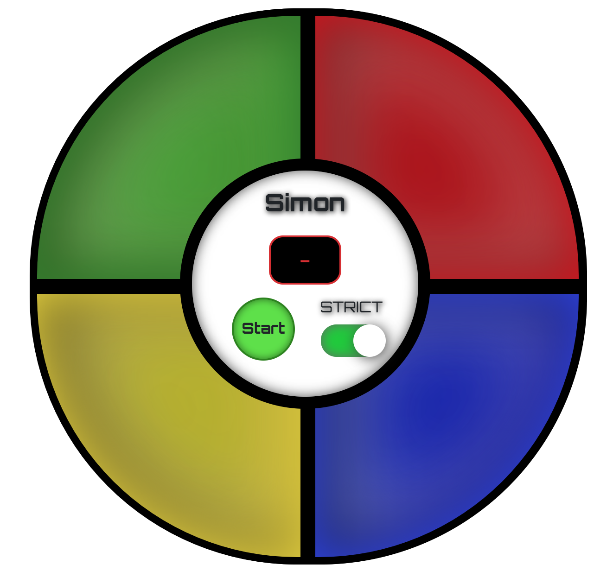
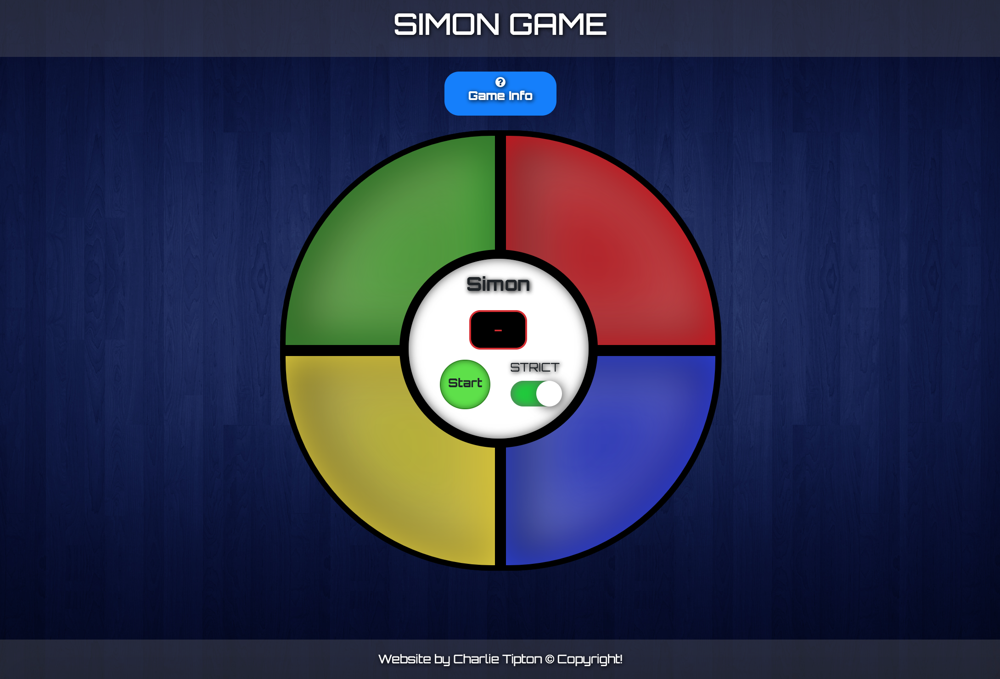
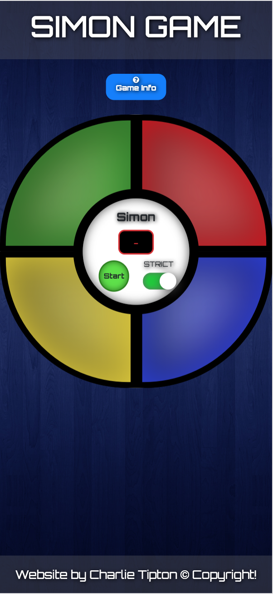
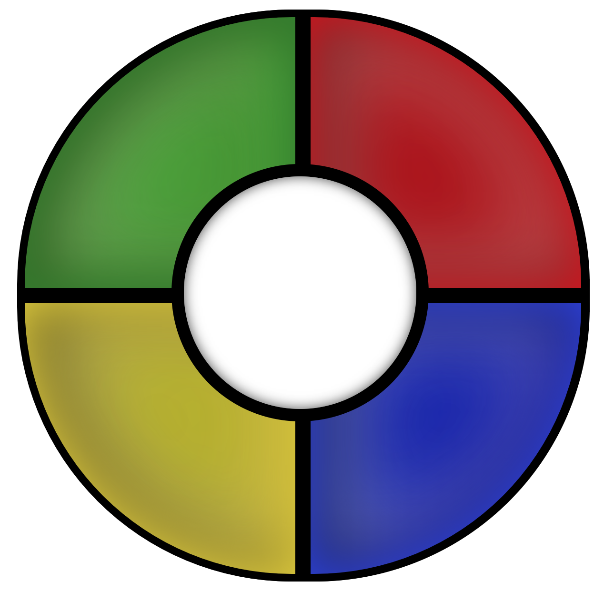
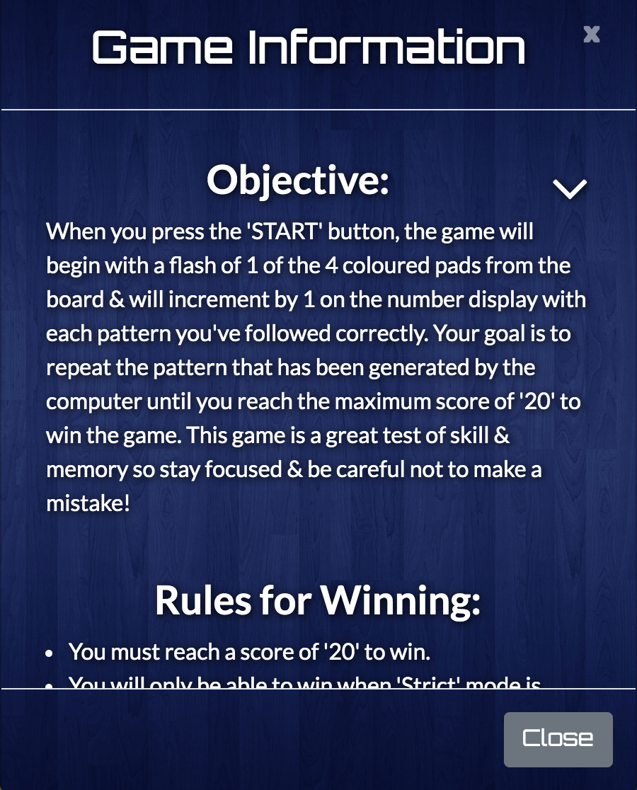
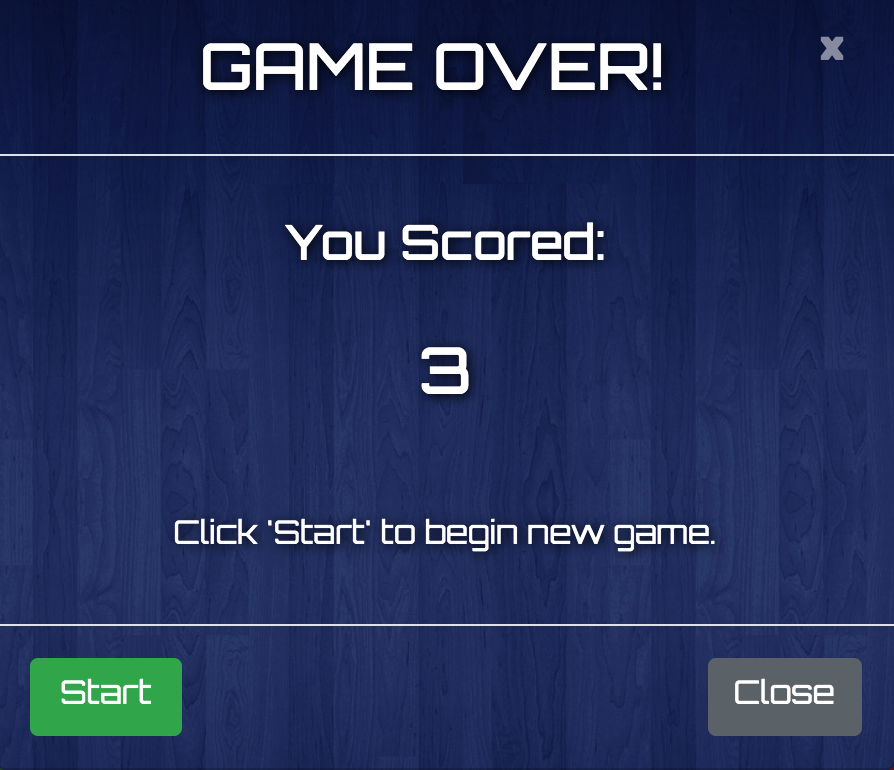
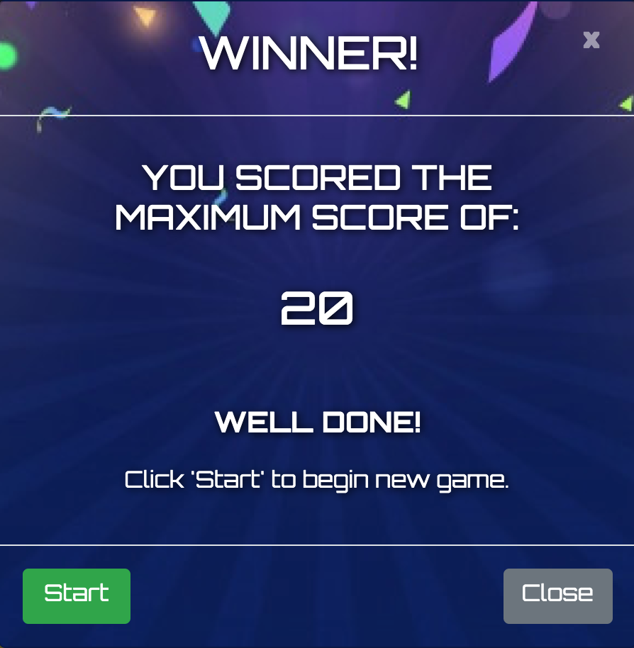
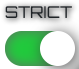
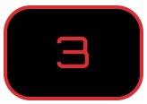

<h1 align="center">
Interactive Frontend - Milestone Project 2 -Simon Game - Charlie Tipton
</h1>

<h1 align="center">

</h1>


<div align="center"> 

[Simon Game](https://charliejt.github.io/Simon-Memory-Game/) is a very popular memory game dating back as far as 1978. It's a game fit for all ages
to test memory and skill. This particular game features a strict option to make the game more challenging yet rewarding and a winning feature is also included
to give the player a goal to achieve. In addition to friendly colours & sounds. You will have many hours of fun playing!
<br><br>
</div>

[View Simon Game page!](https://charliejt.github.io/Simon-Memory-Game/)

[View Website Development in Cloud 9!](https://ide.c9.io/charliejt/interactive_frontend_project)


## Contents Table

1. [**UX**](#ux)
    - [**Project Purpose**](#project-purpose)
    - [**Player Experience**](#player-experience)
    - [**Design Ideas**](#design-ideas)
    - [**Wireframes**](#wireframes)
    - [**Developer and Business Purpose**](#developer-and-business-purpose)

2. [**Features**](#features)
    - [**Existing Features**](#existing-features)
    - [**Features Left to Implement**](#features-left-to-implement)

3. [**Technologies Used**](#technologies-used)

4. [**Testing**](#testing)

5. [**Deployment**](#deployment)

6. [**Credits**](#credits)
    - [**Contents**](#contents)
    - [**Media**](#media)
    - [**Acknowledgements**](#acknowledgements)


## UX

### Project Purpose

The main purpose of the Simon game is to provide a fun, challenging yet rewarding experience to users of all ages.

### Player Experience

- Players immediately experience a clear, easy and intuitive feel for the game right away. Simple controls which allow the player to have an easy understanding of how to play the game. 
- Should the player be confused at any point, a 'Game-Info' box has been provided to give an informative description of what features the game has to offer.

- Inviting sounds & bright colours have been added to each pad to give the player a clear distinction between each pad.
Winning & losing features have also been included with modal pop-ups & sounds to provide the player with additional challenges and goals to achieve.

- The player has no need for a back button or to reload the page. Easy and informative buttons have been provided at all times to ensure the
the player has an easy way around the game.

### Design Ideas

The design of the game is intended to replicate the original 1978 Simon Game with a slightly modernized touch to it.

- #### Fonts

    - The font **'Orbitron'** was chosen as the primary font to create the feel for an original and retro looking style to the game.
    - The font **'Lato'** was chosen as the font for the 'Game-Info' modal to ensure the text is easy to read.

- #### Colours

    - **Main Heading and Footer -** A white font was chosen to contrast nicely with the background of the webpage.
    A white opaque background colour was chosen to indicate the header & footer fields as well as still showing the background.
    
    - **Simon Board Border -** A black border was chosen as a nice separation between each colour on the board. It is also,
    the colour that was chosen for the original Simon Game.
    
    - **Coloured Pads -** The pads were styled with the 4 original colours of the game 'green', 'red', 'yellow' and 'blue'
    just like the original Simon Game.
    
    - **Controls Pad -** A white background with black text was chosen as the controls display colours
    to ensure everything is easily displayed.
    
    - **Start Buttons -** A green colour has been chosen for the start buttons for an inviting feel to starting a game.
    
    - **Number Display -** The number display has been styled with red text & border with a black background.
    This is to display a nice retro looking number display.
    
    - **Strict Slider -** A green and grey colour has been chosen for the strict slider to indicate whether strict is active or not.
    Green was chosen for the active colour as green is a nice inviting colour.
    
    - **Game-Info Button -** A light blue colour was chosen for the Game-Info button to compliment the dark blue background of the webpage.
    
    - **Close Buttons -** The default colour of grey was kept for the close buttons in modals as grey signifies that you don't get much use out of it other than
    it closes the modal.

- #### Styling

    Styles have been incorporated to give the game as much of a 'real life' experience as possible. `box-shadow`'s
    have been included to provide a professional and innovative look as well as keeping to the original design of the game. 
    `cursor`'s have been added to each active clickable item for a better indication of where & when you can click.
    Also, pads have been styled to have a very slight 3D effect to them.
    
    **Special styles include:**
    
    - **Flashing Pads -** Flashing pads have been designed to replicate a real flashing of a light, with the use of
    inset & non-inset `box-shadow`'s, the effect has been achieved.
    
    - **Start Button** The start button has been carefully designed to act as a real button. With the use of an inset
    `box-shadow` upon clicking, the effect of a button being pressed has been achieved.
    
    - **Strict Slider** The strict slider's original state was a checkbox, the use of a `checkbox`, however, didn't look very appealing. After the help of a video seen you YouTube, I was able to achieve the effect of a Strict slider.
    [How the effect was achieved!](https://www.youtube.com/watch?v=BQSNBa3gZJU)
    
    - **Buttons -** All buttons are styled to slightly reduce in size when each of them is clicked. Giving them
    the effect of a real button being clicked.
    
- #### Backgrounds

    All background images have been requested by the developer and been granted permission to use them for educational purposes.
 
    - The main background of the Simon board game is an image of a flat surface with a navy blue laminate effect to 
    insinuate either a floor or a table top. This gives a nice surface top for the Simon Board to be positioned on. The
    'Game-Info' modal & the 'Lose' modal also has the same background.
    
    - A Celebratory background has been applied to the 'Win' modal to give a nice sense of achievement and reward.
    
### Wireframes

Wireframes were made using [Balsamiq](https://balsamiq.com/) for a clean looking design layout.

- #### Desktop Wireframes

    - [Main - Desktop Display](readme-images/wireframes/desktop-wireframes/main-desktop-wireframe.png) 
    - [Game-Info Modal - Desktop Display](readme-images/wireframes/desktop-wireframes/info-desktop-wireframe.png)
    - [Lose Modal - Desktop Display](readme-images/wireframes/desktop-wireframes/lose-desktop-wireframe.png)
    - [Win Modal - Desktop Display](readme-images/wireframes/desktop-wireframes/win-desktop-wireframe.png)
    
- #### Tablet Wireframes

    - [Main - Tablet Display](readme-images/wireframes/tablet-wireframes/main-tablet-wireframe.png)
    - [Game-Info Modal - Tablet Display](readme-images/wireframes/tablet-wireframes/info-tablet-wireframe.png)
    - [Lose Modal - Tablet Display](readme-images/wireframes/tablet-wireframes/lose-tablet-wireframe.png)
    - [Win Modal - Tablet Display](readme-images/wireframes/tablet-wireframes/win-tablet-wireframe.png)

- #### Mobile Wireframes

    - [Main - Mobile Display](readme-images/wireframes/mobile-wireframes/main-mobile-wireframe.png)
    - [Game-Info Modal - Mobile Display](readme-images/wireframes/mobile-wireframes/info-mobile-wireframe.png)
    - [Lose Modal - Mobile Display](readme-images/wireframes/mobile-wireframes/lose-mobile-wireframe.png)
    - [Win Modal - Mobile Display](readme-images/wireframes/mobile-wireframes/win-mobile-wireframe.png)
    
### Developer and Business Purpose

- Should be prepared for any double click, fast clicking or clicking different parts of the board
when each feature is running or not running at unexpected times. Every feature must run with its intended
function at any given time.

- Must show clear & professional examples of JavaScript, jQuery & Jasmine.

- A great example project to put as part of a portfolio.


## Features

### Existing Features

1. #### Dashboard 

    - When you arrive at the page for the very first time, you will be presented with a header, footer, a 'Game-Info'
    button & the Simon Board. 
    
    - Each of the coloured pads will not be active at first and if you click them, they will not do anything.
    
    - The number display will show a dash symbol '-'  until the first game is initialized. It has been programmed
    to show the dash symbol until the first game has begun.
    
    - Strict mode will have a default setting of being 'active' to recreate the setting the original Simon Game upon load.
    
    <br>
    
    
    <br><br>
    
2. #### Coloured Pads 

    - The coloured pads are the paramount components of the board. This is where you interact with the game being played.
    
    - When you start a game, you will get a flashing of one of the coloured pads with a different sound generated for each of the pads,
    the pads have been designed to replicate a real light being flashed. When the sequence has finished being generated by the computer,
    it will then become 'active' for the player to click each pad in the correct order.
    
    - You will not be able to click on the pads whilst the computer sequence is running, when a game is not being played or when you win or lose the game. 
    The game has been carefully programmed to be active and not active at relevant points in the game.
    
    <br>
    <div align="center">  
    
    </div><br><br>    
    
    
3. #### 'Game-Info' Modal

    - When you click on the 'Game-Info' button, you're presented with a modal with information about how the game is played.
    There is also a clickable down-arrow icon to enable the user to scroll down when it's clicked. The Game-Info modal has been implemented
    to ensure that the user is not at all confused with how to play the game.
    
        **The sections:**
        
        - **Objectives** - To give a description of how the game is played and to inform the user of the goal.
        - **Rules for Winning** - To inform the user of how they can win the game. This has been provided in case the user is confused about how they can achieve a win.
        - **Buttons** - The 'Buttons' section is added to give a full understanding of how each button works & uses for the buttons.
    
    <br>
    <div align="center">  
    
    </div><br><br>

4. #### Lose Modal

    - When a sequence is wrong in strict mode, a 'Lose' modal will appear with your score showing that it's 'Game Over!',
    You also have the option to start a new game or to close the modal. These buttons have been provided so that the user
    can click to start a new game right away and click close to change settings or if they don't feel like playing another game.
    
    <br>
    <div align="center">  
    
    </div><br><br>
    
5. #### Win Modal

    - When you get 20 sequences correct in strict mode without making a single mistake, there will be a win modal which will appear with a
    celebratory sound & image. It will inform you that you have reached the maximum score of '20' and will give you the option to either begin
    a new game or to close the modal. These buttons have been provided so that the user can click to start a new game right away and click
    close to change settings or if they don't feel like playing another game.
    
    <br>
    <div align="center">  
    
    </div><br><br>
    
6. #### Start Button

    - When 'Start' is clicked, the game begins & the computer will begin its first sequence for the player to follow.
    every time that the button is pressed, it will begin a brand new sequence. Start buttons are also included in
    the Lose Modal & in the Win Modal so the player begin there next sequence right away.
    
    <br>
    <div align="center">  
    
    </div><br><br>
    
7. #### Strict Slider

    - The 'Strict' slider has been included to add different options of playing. When strict mode is active (green), 
    if at anytime the player get a sequence wrong, it will be game over. If strict mode is not active (grey), the 
    player will be able to repeat a sequence over & over until they manage to get it right, strict mode not being 
    active will not be limited and the player can play for however long he likes. However, the player will not have 
    the option to win unless strict mode is active.
    
    - If strict mode is not active and the player clicks it to become active. Any games that were being played
    will be lost and the game will begin at '0' again.
    
    - Strict mode has been implemented into the game for those with different levels of capabilities.
    
    <br>
    <div align="center">  
    
    </div><br><br>
    
8. #### Number Display

    - When the page is loaded, the number display will display '-', it will appear like this until the player clicks 'Start'.
    
    - When the 'Start' button is clicked, the number '0' will appear in the number display. With each sequence followed correctly
    the number display will increment by 1. The number display will show the number of sequences guessed correctly, not which level
    the player is currently on.
    
    <br>
    <div align="center">  
    
    </div><br><br>

### Features Left to Implement

1. #### Limitless Strict mode

    - An option where the player can stay in strict mode and not be limited to 20 moves until they win. 
    It would carry on playing until the player loses. This would allow the player to really test themselves to 
    see how far they would be able to go in strict mode.

2. #### Player Data Storage and High Score Modal

    - An option where a player can enter their name and it will be stored in data as their username.
    
    - A high score modal can be incorporated so that a player can them play against themselves in order to beat 
    their previous score. This will give the players extra goals to beat their previous scores.
    
3. #### Difficulty options

    - A feature where you can select a difficulty, ranging from Beginner, Intermediate & Expert.
    
    - The difficulty will be the speed in which the sequence is generated, Beginner will be slow,
    Intermediate will be medium speed and Expert will be fast. This would then spread out the capability levels 
    of players and give them extra challenges to overcome.

  
## Technologies Used

- This project uses HTML, CSS, JavaScript and various different technologies to work as helpers to the languages.
- #### [Cloud9](https://c9.io)
    - **Cloud9** is an IDE used to develop the website.
- #### [Bootstrap](https://www.bootstrapcdn.com/)
    - **Bootstrap** is used to create easier & cleaner responsiveness in addition with helping maintain padding and margins.
    - It's also used to include modal features to the website to give it a professional look.
- #### [Google Fonts](https://fonts.google.com/)
    - **Google Fonts** has been used to provide clean and eye-catching fonts to the website.
- #### [JQuery](https://jquery.com)
    - **JQuery** has been used to simplify DOM manipulation.
- #### [Font Awesome](https://www.bootstrapcdn.com/fontawesome/)
    - **Font Awesome** has been used to add icons to the website.
- #### [Jasmine](https://jasmine.github.io/)
    - **Jasmine** is used as a TDD (Test-driven development) tool to automatically test JavaScript and JQuery code.
- #### [Jasmine-JQuery](https://github.com/velesin/jasmine-jquery)
    - **Jasmine-JQuery** is used to ensure JQuery code can be run through Jasmine testing.
- #### [GitHub](https://github.com/)
    - **Github** is used as a remote backup of code used in the project
    - Is used as a remote server for another user to see the code used in the project
    - For users to view the deployed version of the website. The deployed version can be viewed [here!](https://charliejt.github.io/Simon-Memory-Game/)


## Testing


## Deployment

The project was built using [Cloud9](https://c9.io), through a built-in function called 'Git', I could commit
the project & push it up to [GitHub](https://github.com/).

- To view the deployed version of [Simon Game!](https://charliejt.github.io/Simon-Memory-Game/) I needed to take the following steps:
    - Log in to [GitHub](https://github.com/).
    - Select **CharlieJT/Simon-Memory-Game** from the list of repositories
    - Select **Settings** from the navbar near the top of the page.
    - Scroll down to where it says **Github Pages**, there is a subtitle labelled **Source**, click that and change the source to be **master branch**.
    - The page is automatically refreshed and ready for deployment, it can take up to 5-10 minutes for it to be viewable.

- To add this repository to your local workspace.
    - Click on the [Simon Game repository on GitHub!](https://github.com/CharlieJT/Simon-Memory-Game) link.
    - Select the green button on the right hand side call **Clone or download** and copy the clone URL.
    - Go into your local workspace and open up a new terminal (git bash).
    - You will need to be inside of the directory that you want to add the cloning to.
    - Type `git clone ` and paste the URL you copied from GitHub and press enter. It should look like this: 
```console
git clone https://github.com/*username*/*repository*
```
The process of cloning will now be completed. For further information on cloning,
 visit [How to clone from GitHub](https://help.github.com/en/articles/cloning-a-repository).


## Credits

### Contents

- All Content has been thought of and written by the Developer. 

### Media

- #### Images
    - The Main background image for the webpage, 'Game-Info' modal & 'Lose' was taken from [**Wallpaper Gallery**](https://wallpaper-gallery.net/).
    - The background for the win modal was taken from [**Freepik**](https://www.freepik.com/)
    - The Simon favicon was created in [**Ionos**](https://www.ionos.co.uk/tools/favicon-generator)

- #### Sounds
    
    - Sounds include 4 pad sounds, a losing sound and a winning sound. The sounds were all created in [**GarageBand**](https://www.apple.com/uk/mac/garageband/)

- #### Help with code

    - Ideas on how to write out my HTML for the Simon Board: [How to Program a Simon Game: HTML](https://www.youtube.com/watch?v=zwKoo7VDj44)
    - Ideas on how to write out my CSS for the Simon Board: [How to Program Simon Game: CSS](https://www.youtube.com/watch?v=muPIIfjazcU)
    - Ideas on how to get started with the Javascript for the Simon Board: [Simon Game JavaScript Tutorial for Beginners](https://www.youtube.com/watch?v=n_ec3eowFLQ)
    - Ideas on how to get the effect for the Strict slider for the Simon Board: [Css Custom Animated Checkbox](https://www.youtube.com/watch?v=BQSNBa3gZJU)
    - Ideas on how to get the modal to scroll down when you click the 'arrow-down' icon in 'Game-Info' modal: [Smooth Scroll Tutorial Using jQuery](https://www.youtube.com/watch?v=6Bd37vCHQ_U)
    
    The code learned from the videos were not copied into the project, they were used as help and guidance to be interpreted in a different and unique way.

### Acknowledgements

A huge thank you to:

- Spenser Barriball (spence_mentor) - For discussing ideas, providing help wherever necessary and also there as a
guide if I'm ever stuck with anything.

- Tim Nelson (2BN-Tim_lead) - For taking the time to review the project and offering me constructive criticism to help
make improvements.

- Simen Dæhlin (Eventyret_mentor) and Anna Greaves (Anna_lead) - With help sorting a merging issue that was occuring with my README.


